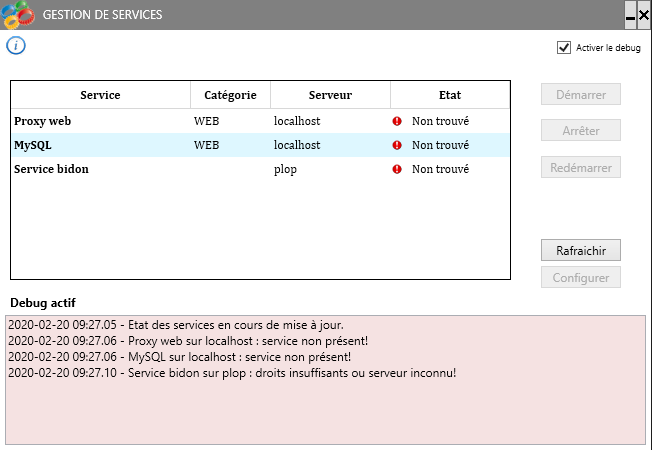

# Service_Manager
Petit outil tout simple de gestion de services

Il permet d'avoir une liste uniquement des services à gérer, avec :
- voir l'état des services
- Ajouter des services distants (autres serveurs, tant que les droits le permette)
- possibilité de stopper, démarrer, rebooter un ou plusieurs services préalablement sélectionnés
- Possibilité d'ouvrir le fichier de log et/ou le fichier de configuration du service
- Possibilité de catégoriser (ex : par application quand chaque appli a plusieurs services associés)

# Configuration
Relativement simple via le fichier config.
Pour chaque service (# étant un numéro à incrémenter à chaque service ajouté) :

### **Obligatoire**
- key \"**Service#**\"
- Value \"**Name;Title;Server**\"
	- Name avec le nom du service
	- Title pour le libellé que vous souhaitez afficher
	- Server pour l \'IP du serveur (ou le DN, localhost,...)

### **Optionnels**

*Si vous voulez une petite bulle d'information au survol de la ligne du serveur :*
- key \"**Tooltip_#**\"
- Value : texte à afficher au survol (tooltips)

*Si vous voulez pouvoir grouper les serveurs par catégorie (type, appli, ou ce que vous voulez) :*
- key \"**Cat_#**\"
- Value : Nom de catégorie

*Si vous voulez lier le fichier de log*
- key \"**Log_#**\"
- Value : Chemin du fichier de log

*Si vous voulez lier le fichier de configuration*
- key \"**Conf_#**\"
- Value : Chemin du fichier de configuration
